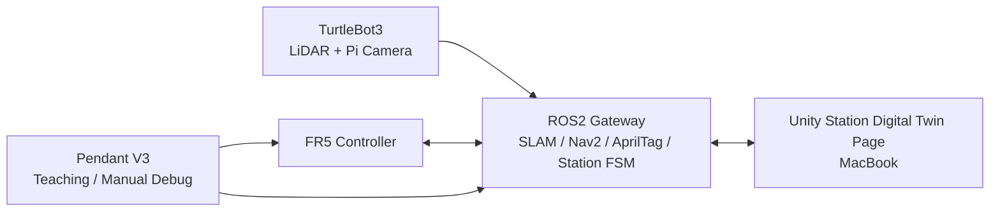
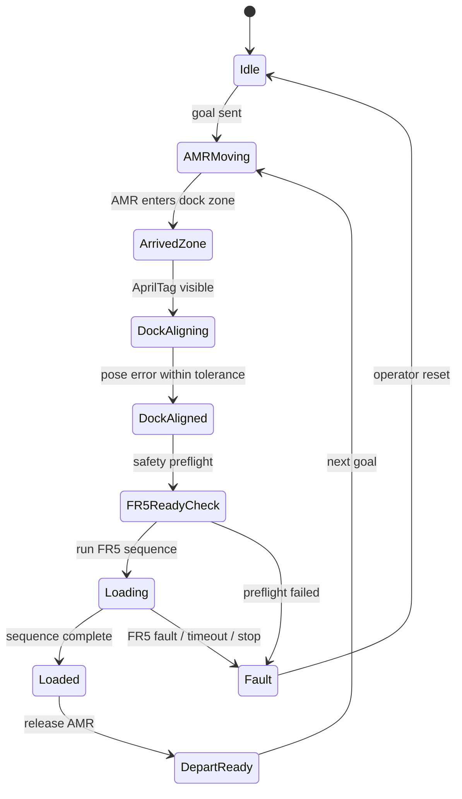
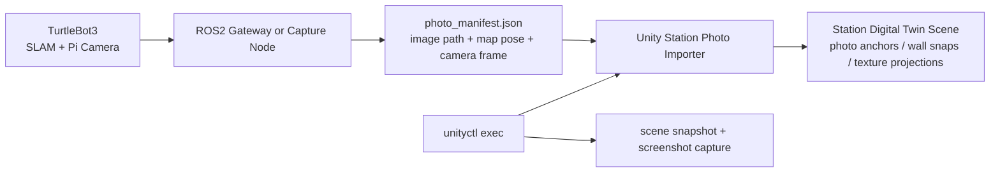
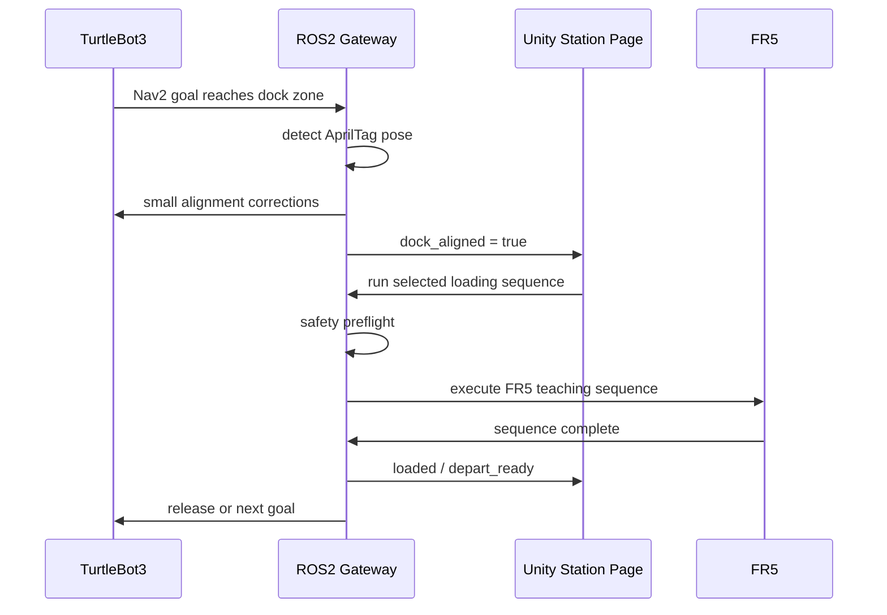

# TurtleBot3 + FR5 Station Digital Twin Plan

## Purpose

TurtleBot3가 경기장 안을 주행하다가 특정 위치에 도착하면, 고정 설치된 FR5가 물건을 적재하고 TurtleBot3가 다시 출발하는 자동 적재 스테이션을 Unity 디지털트윈으로 구현한다.

이 문서는 현재 결론을 하나의 기준선으로 잠근다.

- `Pendant V3`: FR5 단독 티칭, 수동 조작, 포인트/루프 검증용 정비실
- `Station Digital Twin Page`: TurtleBot3 + ROS2 + FR5 적재 스테이션 관제실
- `ROS2 Gateway`: 실제 장비 통신, 상태머신, 안전 조건, 실행 권한의 중심
- `Unity on MacBook`: 시각화, 설정, 운영자 UI, 티칭 결과 선택/실행 요청

## Final Hardware Direction

최초 구현은 `TurtleBot3 LiDAR + Raspberry Pi Camera + AprilTag` 조합으로 진행한다.

| 구성 | 역할 | 채택 이유 |
|---|---|---|
| TurtleBot3 2D LiDAR | SLAM, Nav2, 위치 추정, 장애물/벽 검출 | 이미 TurtleBot3 주행의 표준 입력이며 ROS2 map 기준을 만든다 |
| Raspberry Pi Camera | 실시간 영상, AprilTag 감지, 도킹 보정, 현장 확인 | 저렴하고 TurtleBot3에 가볍게 장착 가능하다 |
| AprilTag | 도킹 위치/각도 정밀 보정 | 2D LiDAR만으로 부족한 마지막 정렬 기준을 제공한다 |
| FR5 | 적재 동작 실행 | 기존 V3 티칭포인트/루프 자산을 재사용한다 |
| MacBook Unity | 디지털트윈 관제/설정 | 현장 상태를 보고, 수정하고, 운영하기 위한 화면이다 |
| ROS2 Gateway PC | 안전 실행 코어 | 실제 장비 제어와 상태머신은 Unity보다 ROS2 쪽에 두는 것이 안정적이다 |

## Explicit Non-Goals For MVP

- Unity 안에 RViz 전체를 복제하지 않는다.
- Polycam 전체 스캔을 시스템 기준 좌표로 삼지 않는다.
- TurtleBot3 기본 2D LiDAR만으로 고품질 3D 경기장 모델을 만들려고 하지 않는다.
- Unity가 직접 FR5와 AMR을 무조건 실행하는 구조로 만들지 않는다.
- Raspberry Pi Camera 하나로 RGB-D/Polycam급 3D reconstruction을 기대하지 않는다.

## Recommended System Architecture



역할은 아래처럼 고정한다.

| 계층 | 책임 |
|---|---|
| TurtleBot3 | 라이다 SLAM, 주행, 카메라 영상/마커 입력 |
| ROS2 Gateway | `/map`, `/tf`, `/scan`, AprilTag pose, Nav2 상태, FR5 실행 상태머신 |
| Unity Station Page | 경기장 시각화, TurtleBot3 위치 표시, FR5 상태 표시, 자동/수동 운영 UI |
| Pendant V3 | FR5 포인트 생성, 루프 테스트, 수동 복구, 실기 디버깅 |

## Unity Page Strategy

새 페이지를 만든다. V3 티칭팬던트에 AMR/ROS 기능을 계속 붙이지 않는다.

### Pendant V3

- FR5 연결/위치 읽기
- 수동/자동 모드 전환
- 티칭포인트 저장/수정
- 단일 포인트/시퀀스/루프 검증
- gripper, joint, TCP, point move 실기 테스트

### Station Digital Twin Page

- 경기장/스테이션 맵 표시
- TurtleBot3 현재 위치/목표/도착 상태 표시
- FR5 현재 상태/작업 단계 표시
- 자동/수동 모드 전환
- 적재 시퀀스 선택
- 시작/일시정지/정지/리셋
- ROS2 Gateway 로그/알람 표시
- AprilTag 도킹 정렬 상태 표시

## ROS2 Topic / Service Contract Draft

Unity는 모든 ROS topic을 직접 노출하지 않고, 운영에 필요한 topic만 구독/발행한다.

### Unity Subscribes

| Topic | 의미 |
|---|---|
| `/map` | TurtleBot3 SLAM 2D occupancy grid |
| `/tf` 또는 gateway pose topic | `map -> base_link` 기준 TurtleBot3 위치 |
| `/scan` | 필요 시 라이다 점/장애물 오버레이 |
| `/amr/status` | moving, arrived, docking, aligned, fault |
| `/amr/goal` | 현재 목적지/도킹 지점 |
| `/station/state` | 스테이션 상태머신 |
| `/station/logs` | 운영 로그 |
| `/fr5/state` | connected, enabled, mode, fault, current sequence |
| `/fr5/joint_states` | FR5 관절 상태 표시 |
| `/fr5/tcp_pose` | TCP 위치 표시 |
| `/dock/apriltag_pose` | 도킹 마커 기준 상대 위치 |

### Unity Publishes Or Calls

| Command | 의미 |
|---|---|
| `/station/set_mode` | 자동/수동 모드 전환 요청 |
| `/station/run_sequence` | 선택한 적재 시퀀스 실행 요청 |
| `/station/pause` | 일시정지 |
| `/station/stop` | 정지 |
| `/station/reset` | fault/상태머신 리셋 요청 |
| `/station/set_config` | 도킹 구역, 시퀀스, 운영 설정 반영 |
| `/amr/send_goal` | 테스트/운영 목적지 전송 |
| `/fr5/stop` | FR5 정지 요청 |

## Station State Machine

최소 상태머신은 아래 흐름으로 시작한다.



초기 자동 실행 조건은 보수적으로 둔다.

- TurtleBot3가 도킹 구역 안에 있음
- AprilTag가 보임
- 도킹 위치 오차가 허용 범위 안에 있음
- FR5 connected/enabled/auto mode/fault-free
- gripper ready
- 작업공간 안전 조건 OK
- 최신 상태 freshness OK
- 운영자가 자동 모드를 켰거나 실행을 승인함

## Coordinate And Calibration Plan

1대1 디지털트윈의 기준은 `ROS map`과 실측 좌표다. 시각 모델이나 스캔 메시를 기준으로 삼지 않는다.

### Frame Draft

```text
map
├─ odom
│  └─ base_link                TurtleBot3
├─ station/fr5_base            실제 FR5 베이스 위치
├─ station/dock_point          TurtleBot3 도킹 목표
├─ station/load_point          적재 기준점
├─ station/apriltag_dock       도킹 AprilTag
└─ station/safety_zone         FR5 작업/금지 구역
```

### Unity Mapping

- `1 Unity unit = 1 meter`
- ROS `map`의 원점/축을 Unity 월드 기준과 명시적으로 변환한다.
- ROS pose는 항상 `coordinate transform`을 통과해 Unity object transform으로 들어간다.
- FR5 베이스, 도킹 지점, 적재 지점은 실측값으로 배치한다.

### Calibration Checklist

- 경기장 원점, X/Y 방향, 바닥 높이 결정
- FR5 베이스 위치와 회전 실측
- 도킹 지점 위치 실측
- AprilTag 실제 위치/높이/방향 측정
- TurtleBot3를 3개 이상의 기준점에 이동시켜 Unity 위치와 비교
- 도킹 지점에서 AprilTag 상대 pose와 SLAM pose 차이 측정
- 오차 보정값을 ROS2 Gateway 또는 Unity mapping config에 저장

초기 목표 오차:

- 시각화: 2-5 cm
- 도착/도킹 판단: 1-3 cm
- FR5 적재 정밀도: 티칭포인트 + 도킹 마커 + 필요 시 별도 물리 가이드로 보정

## Physical Truth Plan

로봇이 믿고 움직일 기준은 포토리얼 스캔이나 Unity 배경 모델이 아니다. MVP의 물리적 진실은 `실측값 + ROS map/tf + AprilTag + FR5 live readback + safety zone collider` 조합으로 만든다.

### Truth Sources

| Truth source | 역할 | 로봇 실행에 사용 가능 여부 |
|---|---|---|
| 실측 경기장 치수 | 벽, 바닥, 도킹 구역, FR5 베이스의 기준 좌표 | yes |
| TurtleBot3 SLAM `/map` | AMR이 주행하는 2D 환경 기준 | yes |
| ROS `/tf` `map -> base_link` | TurtleBot3 현재 위치/방향 | yes |
| AprilTag pose | 최종 도킹 위치/각도 보정 | yes |
| FR5 live readback | connected, enabled, mode, fault, joint/TCP state | yes |
| Unity blockout colliders | 안전 구역/금지 구역/작업 영역 표시와 검증 | yes, after calibration |
| Polycam / 3DGS / photo scan | 실제처럼 보이는 시각 배경 | no |
| Unity decorative assets | 경기장 분위기와 운영자 이해 보조 | no |

### Runtime Gate

ROS2 Gateway는 아래 조건이 모두 참일 때만 FR5 적재 시퀀스를 실행한다.

```text
AMR pose fresh
SLAM/localization healthy
AMR inside dock zone
AprilTag visible
AprilTag pose error within tolerance
FR5 connected
FR5 enabled
FR5 automatic mode
FR5 fault-free
FR5 readback fresh
station safety zone clear
selected teaching sequence validated
operator mode allows execution
```

이 중 하나라도 실패하면 Unity는 실행 버튼을 누를 수 있더라도 `blocked` 상태와 이유만 표시한다. 실제 실행 권한은 ROS2 Gateway가 가진다.

### Unity Representation

Unity 안에는 두 종류의 모델을 분리해서 둔다.

```text
Truth geometry
  -> 실측 blockout
  -> calibrated colliders
  -> dock zone
  -> load zone
  -> safety zone

Visual geometry
  -> photo textures
  -> modular assets
  -> optional Polycam mesh
  -> optional Gaussian Splat background
```

`Truth geometry`는 작고 단순해야 한다. 벽, 바닥, FR5 베이스, 도킹 구역, 안전 구역처럼 로봇 실행 판단에 필요한 것만 포함한다.

`Visual geometry`는 운영자 이해와 시연 품질을 위한 레이어다. 이 레이어가 어긋나거나 무거워져도 로봇 실행 판단이 바뀌면 안 된다.

### Verification Loop

초기 현장 세팅마다 아래 순서로 물리적 진실을 검증한다.

1. TurtleBot3로 SLAM map을 만든다.
2. 실측 blockout과 SLAM map overlay를 Unity에서 맞춘다.
3. TurtleBot3를 기준점 3곳 이상으로 이동시켜 `map -> Unity` 변환 오차를 기록한다.
4. 도킹 지점에서 AprilTag pose 오차를 측정한다.
5. FR5 베이스와 load point가 Unity/ROS 기준에서 같은 위치인지 확인한다.
6. FR5 sequence는 dry-run 또는 빈 그리퍼 조건으로 먼저 실행한다.
7. 오차가 허용 범위 안에 들어온 뒤에만 자동 적재 실행을 허용한다.

이 검증 결과는 이후 `station calibration config`와 field log에 남긴다.

## Visual Modeling Strategy

기본 Unity 박스만으로 최종 경기장 느낌을 만들지 않는다. 대신 아래 3층 구조를 사용한다.

| 레이어 | 기준 | 용도 |
|---|---|---|
| 정확한 구조 레이어 | 실측 + ProBuilder/blockout | 벽, 바닥, 도킹 구역, FR5 베이스, 안전 구역 |
| ROS 검증 레이어 | TurtleBot3 `/map` overlay | 실제 SLAM 맵과 Unity 구조 비교 |
| 시각 품질 레이어 | 사진 텍스처, Blender 모델, 에셋, 선택적 Polycam | 실제 경기장처럼 보이는 배경/소품 |

Polycam이나 RGB-D 카메라는 나중에 쓸 수 있지만, MVP 기준에서는 필수가 아니다. 쓰더라도 아래 원칙을 지킨다.

- Polycam scan은 시각 참고/배경용이다.
- 주행/좌표/도착 판단은 ROS `map`과 실측값이 기준이다.
- 스캔 메시를 collision, navigation, safety truth로 쓰지 않는다.

## SLAM Photo Placement And Unityctl Import Plan

일반인이 봐도 현실과 비슷한 경기장 모델을 만들기 위해, TurtleBot3 주행 중 촬영한 사진을 SLAM pose와 함께 기록하고 Unity 안에 자동 배치하는 시각 레이어를 추가한다.

이 기능은 `Visual geometry` 확장이다. 로봇 실행 판단의 truth source가 아니며, FR5 실행 권한이나 AMR 도킹 판단을 바꾸지 않는다.

### Goal

- TurtleBot3가 SLAM/Nav2 주행 중 현장 사진을 촬영한다.
- 사진마다 촬영 시점의 `map -> base_link` pose, 카메라 frame, timestamp를 같이 저장한다.
- ROS2 Gateway 또는 별도 capture node가 `photo_manifest.json` 형태로 사진 메타데이터를 내보낸다.
- Unity import tool이 manifest를 읽고 사진을 Unity map 좌표계에 자동 배치한다.
- `unityctl exec`는 Unity importer 실행, 씬 저장, screenshot evidence capture에 사용한다.

### Minimum Data Contract

```json
{
  "map_frame": "map",
  "unity_mapping_profile": "station_default",
  "photos": [
    {
      "id": "dock_wall_001",
      "image_path": "Assets/Runtime/StationPhotos/dock_wall_001.jpg",
      "timestamp": "2026-05-21T12:34:56.000+09:00",
      "robot_pose_map": {
        "x": 1.25,
        "y": -0.42,
        "yaw_deg": 91.0
      },
      "camera_frame": "camera_link",
      "camera_mount": {
        "x": 0.08,
        "y": 0.0,
        "z": 0.18,
        "pitch_deg": 0.0,
        "yaw_deg": 0.0
      },
      "tags_seen": [
        {
          "family": "tag36h11",
          "id": 7,
          "relative_pose": "optional"
        }
      ],
      "placement_hint": "photo_anchor"
    }
  ]
}
```

초기 manifest는 완벽한 3D 재구성을 목표로 하지 않는다. 사진, pose, 카메라 방향, 선택적 AprilTag 관측값을 한 번에 묶어 Unity가 재현 가능한 방식으로 배치하게 만드는 것이 목적이다.

### Placement Levels

| 단계 | 배치 방식 | 기대 품질 | 사용 조건 |
|---|---|---|---|
| Level 1 Photo Anchor | 촬영 위치와 방향에 사진 핀/패널을 배치 | 현장 사진 지도 | SLAM pose만 있어도 가능 |
| Level 2 Direction Board | 카메라 방향 앞에 사진 billboard를 배치 | 어느 방향을 봤는지 이해 가능 | `map -> base_link`, camera mount 필요 |
| Level 3 Wall Snap | 카메라 ray를 실측 blockout 벽에 쏴서 가장 가까운 벽에 사진을 붙임 | 경기장 벽/구역과 유사 | 실측 wall collider 필요 |
| Level 4 AprilTag Assisted Snap | 사진에 보인 AprilTag를 기준으로 위치/회전 보정 | 주요 지점 정렬 품질 상승 | AprilTag pose 필요 |
| Level 5 Texture Projection | 보정된 사진을 벽/바닥 텍스처처럼 투영 | 일반인에게 현실감 높음 | 충분한 보정, 수동 QA 필요 |

MVP는 Level 1-2로 시작한다. 일반인에게 경기장 감각을 주는 1차 결과는 `SLAM 경로 + 사진 앵커 + 클릭 가능한 현장 이미지`다. 이후 실측 blockout과 AprilTag가 준비되면 Level 3-4를 붙이고, 최종 시각 품질 단계에서 Level 5를 선택적으로 적용한다.

### Runtime / Tooling Flow



권장 명령 흐름은 아래와 같다.

```text
ROS2 capture node
  -> save jpg/png files
  -> write photo_manifest.json

unityctl exec
  -> KineTutor3D.EditorTools.StationPhotoImporter.ImportManifest(...)
  -> create/update photo anchors
  -> optional wall snap using calibrated colliders
  -> save scene

unityctl screenshot capture
  -> verify imported photos are visible and aligned enough for operator review
```

### Accuracy Boundaries

- 2D LiDAR SLAM만으로는 사진 속 물체의 3D 위치를 자동으로 정확히 알 수 없다.
- SLAM pose는 `사진을 찍은 로봇 위치`를 알려준다. 사진 안의 벽/소품 위치는 실측 blockout, wall collider, AprilTag, 또는 수동 QA가 보정한다.
- 사진 자동 배치 결과가 어긋나도 FR5 실행, AMR 도킹, safety zone 판단은 바뀌면 안 된다.
- 자동 배치에는 `confidence`나 `placement_level`을 표시하고, 운영자가 수동 보정한 값은 별도 override config로 저장한다.

### Acceptance Criteria

- TurtleBot3 주행 중 촬영한 사진 파일과 pose manifest가 같은 timestamp 기준으로 묶인다.
- Unity에서 `1 Unity unit = 1 meter` mapping을 통과해 사진 앵커가 map 위에 나타난다.
- 사진 앵커는 촬영 위치, 바라본 방향, 썸네일/확대 보기 상태를 가진다.
- 실측 wall collider가 있을 경우 wall snap preview를 만들 수 있다.
- AprilTag가 사진에 보이면 해당 사진은 tag-assisted placement 후보로 표시된다.
- `unityctl`로 importer 실행 후 scene snapshot과 screenshot evidence를 남길 수 있다.
- 이 레이어는 visual-only로 분류되고, station safety gate의 truth source 목록에 들어가지 않는다.

## Raspberry Pi Camera + AprilTag Use

라즈베리파이 카메라는 3D reconstruction용이 아니라 도킹 보정과 현장 확인용으로 쓴다.

### Primary Uses

- AprilTag 감지
- 도킹 위치/각도 보정
- 카메라 영상 Unity 표시
- 적재 스테이션 앞 상태 확인
- 표지판/색상/간단 객체 확인

### AprilTag Docking Flow



### Why This Is Enough For MVP

- LiDAR handles map and broad localization.
- AprilTag handles final docking pose.
- FR5 sequence uses known teaching points.
- Unity displays status and lets the operator approve or adjust.

## Safety And Execution Rules

Unity can request execution. ROS2 Gateway decides whether execution is allowed.

ROS2 Gateway must own:

- FR5 connected/enabled/mode/fault preflight
- AMR docked/aligned truth
- stale data detection
- stop/fault transitions
- AMR release condition
- manual/auto mode lock
- timeouts and recovery

Unity must show:

- current station state
- last accepted command
- why a command is blocked
- latest log/fault
- connected/enabled/mode/freshness indicators
- operator controls for stop/reset/manual override

## Implementation Phases

### Phase 1: Unity Station Page Simulation

- 새 `Station Digital Twin` 페이지 생성
- 가상 TurtleBot3 pose 표시
- 가상 도착 구역 진입 이벤트
- 가상 FR5 loading sequence state 표시
- V3 티칭포인트/시퀀스 이름을 선택하는 UI 초안

### Phase 2: ROS2 Gateway Minimal Bridge

- TurtleBot3 `/map`, `/tf`, `/amr/status`를 gateway에서 정리
- Unity가 TurtleBot3 위치와 map overlay를 표시
- `/station/state`, `/station/logs` 기본 발행

### Phase 3: AprilTag Docking

- Raspberry Pi Camera 장착
- camera -> base_link static transform 캘리브레이션
- AprilTag 감지 노드 연결
- dock zone + tag alignment 조건 발행
- Unity에서 aligned / misaligned / tag lost 표시

### Phase 4: FR5 Sequence Integration

- V3에서 검증한 티칭포인트/시퀀스를 station sequence로 참조
- ROS2 Gateway에서 FR5 preflight 수행
- Unity는 실행 요청만 보내고 gateway가 승인/차단
- 완료 후 TurtleBot3 depart-ready 상태 발행

### Phase 5: Reality Matching And Visual Polish

- 실측 기반 경기장 blockout 정리
- SLAM map overlay와 벽/구역 오차 측정
- 바닥/벽/표지판/적재대 시각 모델 보강
- 카메라 영상 panel, log panel, alarm panel 정리

### Phase 6: Field Safety Hardening

- stop/fault/retry UX
- 네트워크 끊김 처리
- data freshness indicator
- manual recovery guide
- operator checklist
- 실제 시연 전 dry-run mode

## MVP Success Criteria

- TurtleBot3가 Nav2로 도킹 구역까지 이동한다.
- Unity에서 TurtleBot3 위치가 경기장 위에 맞게 보인다.
- AprilTag가 보이면 `dock_aligned` 상태가 Unity에 표시된다.
- Unity에서 선택한 적재 시퀀스 실행 요청이 ROS2 Gateway로 간다.
- ROS2 Gateway가 FR5 preflight를 통과할 때만 FR5 시퀀스를 실행한다.
- FR5 완료 후 Unity가 `loaded / depart_ready`를 표시한다.
- TurtleBot3가 다음 목표로 출발할 수 있다.
- 실패 시 Unity가 "왜 막혔는지"를 운영자가 이해할 수 있게 표시한다.

## Future Upgrade Paths

아래는 MVP 이후 선택지다.

- RGB-D camera 추가: RTAB-Map / nvblox 기반 3D map 초안 생성
- Polycam scan 추가: 경기장 시각 품질 보강
- 물리 도킹 가이드 추가: FR5 적재 정밀도 상승
- load sensor / limit switch 추가: 실제 적재 완료 확인
- gripper camera 추가: 물체 위치 확인
- Foxglove/RViz 병행: 개발자 디버깅 강화

## Current Recommendation

주인님 프로젝트의 최적 1차 결과는 아래 형태다.

```text
TurtleBot3 LiDAR
  -> ROS2 SLAM/Nav2 map and pose

Raspberry Pi Camera + AprilTag
  -> final docking alignment

FR5 Pendant V3
  -> teaching points and sequence validation

ROS2 Gateway
  -> station state machine, safety gate, AMR/FR5 execution

Unity Station Digital Twin Page
  -> operator view, configuration, logs, visual matching
```

이 구조는 비용을 낮게 유지하면서도 실제 장비와 Unity 디지털트윈을 안정적으로 연결한다. 고품질 3D 모델링은 MVP 이후 `실측 blockout + SLAM overlay + 사진/Blender/선택적 Polycam` 순서로 확장한다.
