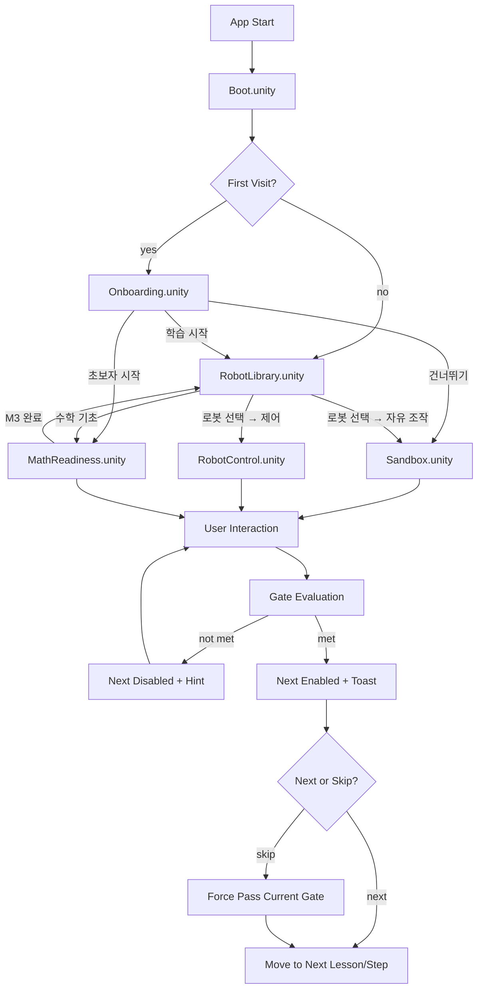

# KineTutor3D User Flow

Version: 2.0.0
Last Updated: 2026-03-23 (KST)
Implementation Status: Navigation Refactor Complete (Boot/Onboarding/RobotLibrary/Sandbox/RobotControl/MathReadiness — Home/Main 제거됨)

## 목표
- 초보 학습자가 수학 이전의 직관 lesson을 거쳐 8단계 코어 튜토리얼까지 압도감 없이 완료한다.
- `Hard gate + Skip` 정책으로 학습 집중과 이탈 방지를 동시에 달성한다.

## Current Runtime vs Product Target
- 현재 런타임 baseline은 `Boot -> Onboarding(첫 방문) -> RobotLibrary`, `Boot -> RobotLibrary(재방문)` 구조가 실제 구현 완료되었다.
- `RobotLibrary`가 메인 진입점이며 로봇 카탈로그 + 3D showroom을 제공한다.
- `RobotControl`은 각 로봇의 전용 제어 콘솔(FR5 구현 완료, 멀티로봇 확장 진행중).
- `Sandbox`는 2DOF/SCARA 자유 조작 학습 공간.
- Editor QA: `BootScenePlayModeSetup`에 의해 어떤 씬이 열려있든 Boot부터 시작. `QaToolsMenu`로 First-Time/Returning User 리셋 가능.
- 본 문서는 현재 런타임 규칙과 차기 P0 target을 함께 추적한다.

## End-to-End Flow (Current Runtime — 실제 구현 기준)
1. 앱 시작
2. `Boot.unity`에서 첫 방문 여부 확인 (`StepProgressSaver.HasVisited()`)
3. 분기
   - 첫 방문: `Onboarding.unity`
   - 재방문: `RobotLibrary.unity`
4. `Onboarding.unity`
   - `학습 시작` (기본 개념 이해): CoreKinematics 트랙 설정 → `RobotLibrary.unity`
   - `초보자 시작` (완전 초보): MathReadiness 트랙 설정 + `2DOF_RR` 선택 → `MathReadiness.unity`
   - `건너뛰기`: CoreKinematics 트랙 설정 → `Sandbox.unity`
5. `RobotLibrary.unity` (메인 허브)
   - 로봇 선택 → `RobotControl.unity` (전용 제어 콘솔)
   - 로봇 선택 → `Sandbox.unity` (자유 조작)
   - `수학 기초` → `MathReadiness.unity`
6. `MathReadiness.unity`
   - `Math Readiness Track`: 0°/90°/180° 기준선 확인 -> 슬라이더 조작 -> 목표 각도 도달 -> 확인 질문
   - M3 완료 시 `RobotLibrary.unity`로 이동
7. `RobotControl.unity`
   - 각 로봇별 전용 제어 콘솔 (FK 슬라이더, TCP 직교 제어, 프리셋, 상태 패널)
   - FR5 구현 완료, 멀티로봇 확장 진행중
8. `Sandbox.unity`
   - `Pre-Kinematics Track`: trail, target, why-it-moved 중심 입력
   - `Core Track`: Step 진행 중 입력(호버/클릭/슬라이더)
   - Slider: `theta` 단일 소스(deg 입력 -> rad 변환)
   - DH Table: `d/a/alpha`만 편집 가능(`theta` read-only)
9. Gate 조건 평가
   - 미충족: Next 비활성, 힌트/토스트 안내
   - 충족: Next 활성, 완료 토스트 표시
10. Step 전환 시 패널/포커스/툴팁 상태 동기화
11. 재방문 시 `Boot -> RobotLibrary`로 복귀

## Next P0 Target Flow
1. 첫 방문은 `Boot -> Onboarding -> RobotLibrary`로 연결한다.
2. `완전 초보`는 `MathReadiness`, `기본 개념 이해`는 `RobotLibrary`로 진입한다.
3. `건너뛰기`는 `Sandbox`로 이동한다.
4. 재방문 기본 진입점은 `RobotLibrary`이다.
5. `RobotLibrary`는 `로봇 제어(RobotControl) / Sandbox / MathReadiness` 진입 허브가 된다.
6. 각 로봇의 `RobotControl`은 전용 제어 콘솔로 확장한다.

## Flow Diagram (현재 구현 기준)

## 상태 전이
- Session: `init -> boot -> onboarding|robotlibrary -> learning -> completed`
- Track: `pre_kinematics | core_kinematics | math_readiness`
- Lesson/Step: `lesson_0 ... lesson_3`, `step_1 ... step_8`
- Gate: `locked -> unlocked`

## Product Target Navigation
1. `Onboarding`은 계속 첫 방문 진입점으로 유지한다.
2. 재방문 기본 진입점은 `RobotLibrary`이다.
3. `RobotLibrary`는 `RobotControl`, `Sandbox`, `MathReadiness` 진입 허브가 된다.
4. 온보딩의 `건너뛰기`는 `Sandbox`로 연결한다.
5. future product target의 `Guided Lesson`은 `완전 초보 -> Pre-Kinematics Lesson 0~3 -> Core Track Step 1~8` 구조를 기본 경로로 가진다.

## UX 게이트 규칙
1. 기본 정책: `Hard gate` (조건 충족 전 Next 비활성)
2. 예외 정책: `Skip` 버튼은 lesson 내부 예외 제어로만 허용하고, 온보딩 shortcut으로 사용하지 않는다.
3. 검증 실패 입력(예: NaN/Infinity)은 계산 파이프라인 진입 금지
4. `Lesson 0~3`에서는 행렬/공식 대신 `trail`, `target marker`, `reach/not reach`, `Why It Moved`를 우선한다.
5. `Math Readiness M0~M3`에서는 질문보다 먼저 3D 각도 기준선과 슬라이더 조작을 제시하고, 목표 각도 도달 후에만 확인 질문을 노출한다.
6. 구현 순서는 `track-aware step foundation`과 `공통 input/visualization`을 먼저 고정한 뒤 `Lesson 0~3`를 연결한다.

## 수용 기준
1. 첫 방문은 `Boot -> Onboarding -> RobotLibrary`, 재방문은 `Boot -> RobotLibrary`로 분기된다.
2. Onboarding 이후 `완전 초보 -> MathReadiness.unity`, `기본 개념 이해자 -> RobotLibrary` 분기가 존재한다.
3. Gate 완료 전 Next 비활성, 완료 후 활성으로 정확히 전환된다.
4. Skip 사용 시 현재 Lesson/Step을 건너뛰고 다음 단계로 정상 진입한다.
5. MatrixDisplay가 `Core Track`에서 `A1/A2/T02`를 이벤트 기반으로 실시간 갱신한다.
6. `Lesson 0~3` 문서 어디에도 sin/cos 공식, 삼각형 유도, Jacobian, DH 표가 핵심 화면으로 요구되지 않는다.
7. `RobotLibrary`가 재방문과 온보딩의 공통 착지점으로 구현 완료되었다.
8. Sandbox에서 학습 패널과 Sandbox 전용 패널이 배타적으로 제어되어 겹치지 않는다.
9. Editor QA: `BootScenePlayModeSetup`으로 어떤 씬에서든 Boot부터 시작, `QaToolsMenu`로 PlayerPrefs 리셋 가능.
10. Onboarding에도 `SceneNavigationBar`를 유지해 페이지 간 즉시 이동과 상태 점검이 가능하다.
