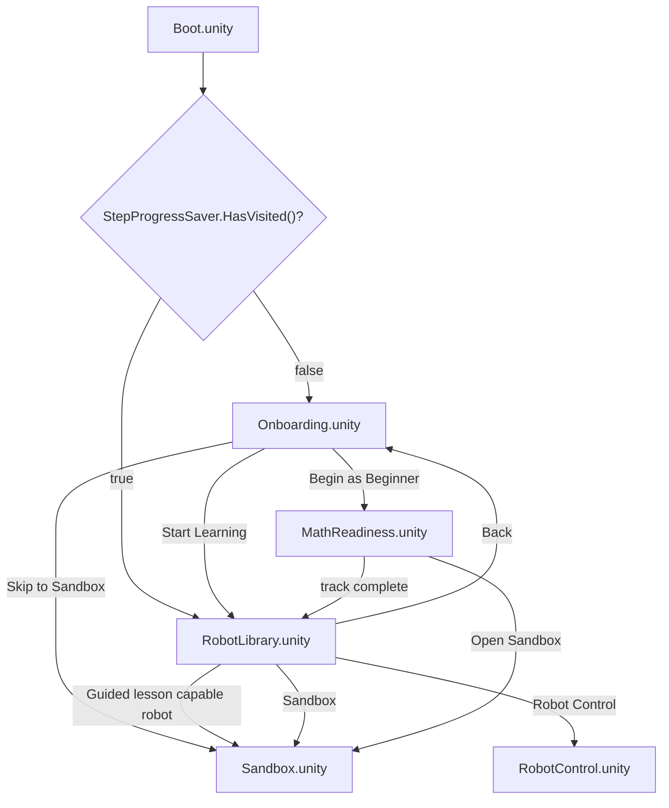
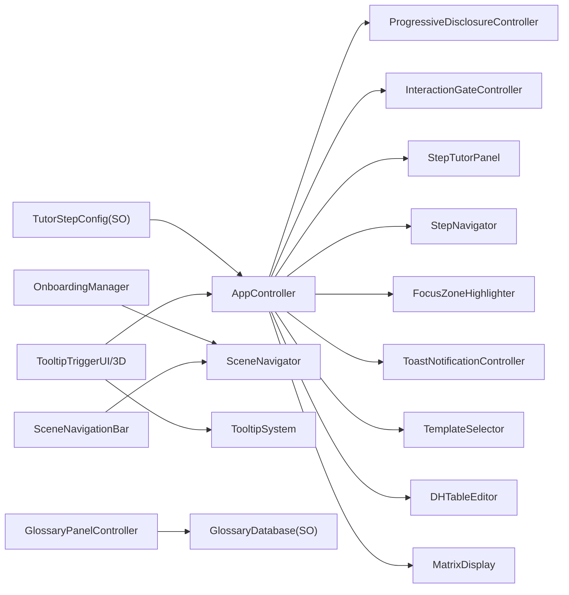
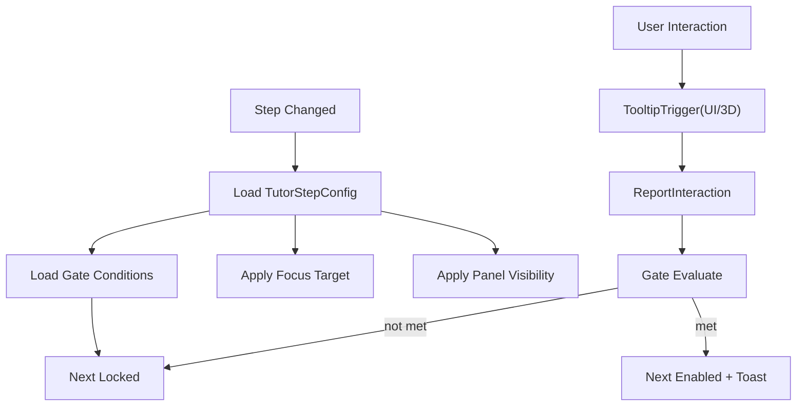
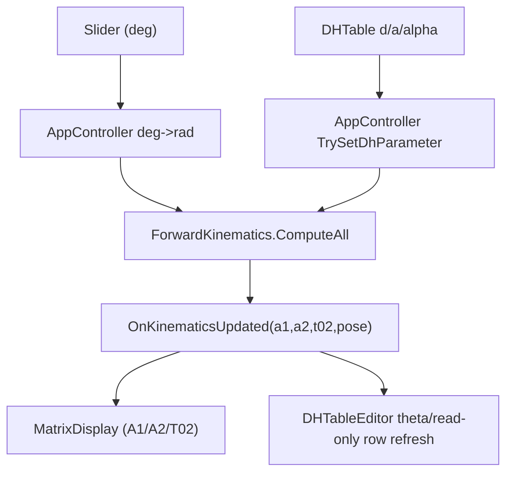
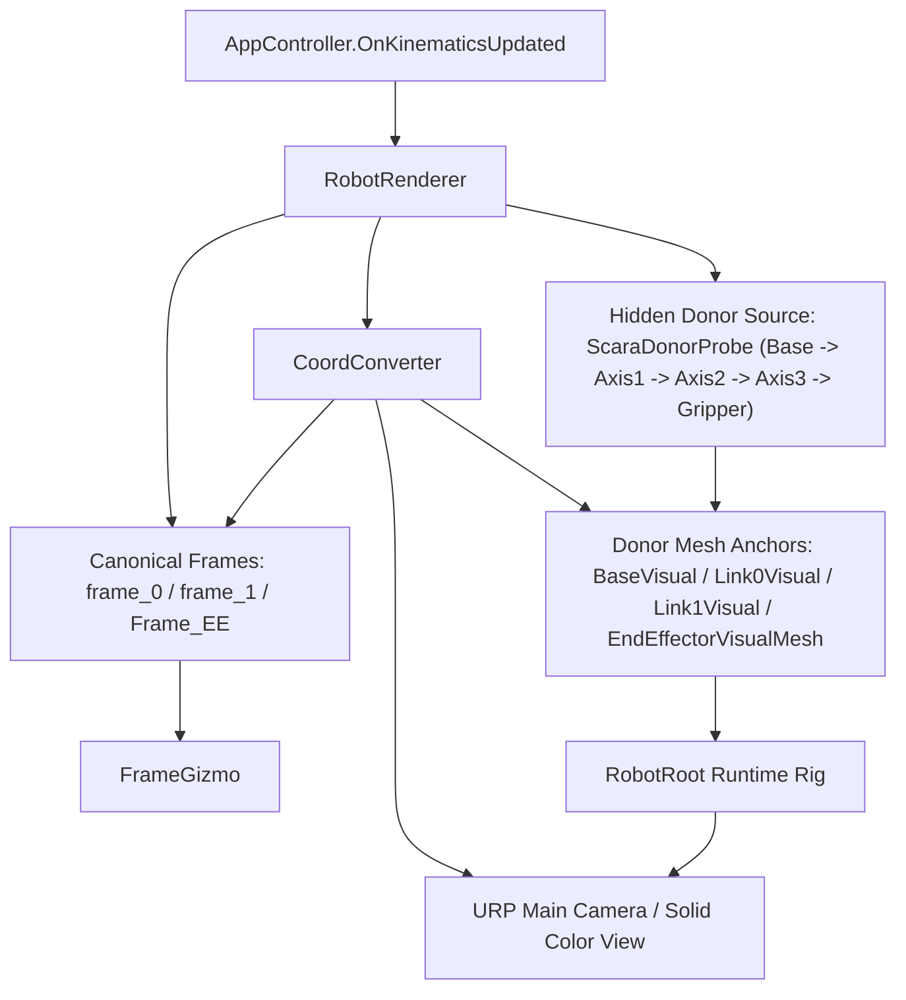
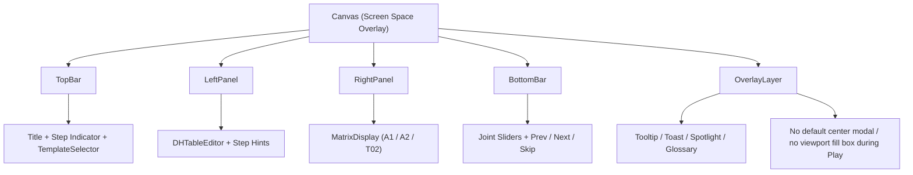
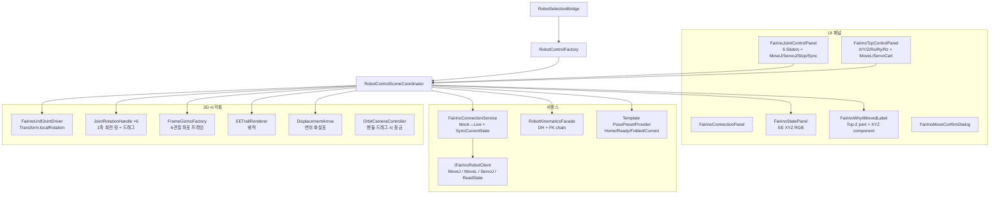
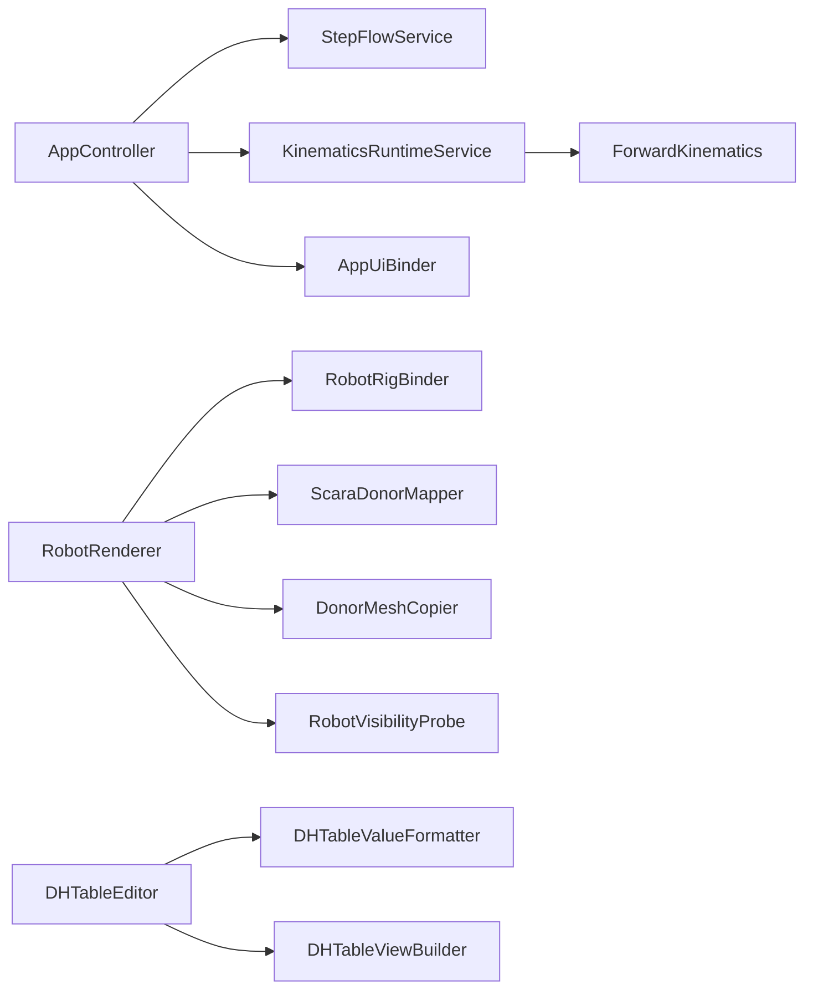

# KineTutor3D Architecture Diagrams

Version: 1.7.0
Last Updated: 2026-03-31 (KST)

> Note: 이 문서는 혼합형 reference 문서라 일부 섹션에 historical naming(`Main`, 초기 RobotControl 구조)이 남아 있다.
> 현재 runtime truth는 `docs/ref/architecture-mermaid.md`와 `docs/ref/project-flow-code-review.md`를 우선한다.

## Fast Context Entry

1. `AGENTS.md`
2. `docs/ref/architecture-mermaid.md`
3. 이 문서

## Scene Flow Map



## UX Module Map (Phase 3 확장)



## Step Runtime Data Flow



## FK Runtime Data Flow (Phase 3 MVP+)



## Visualization Runtime Data Flow (Phase 4 Core)



## Scene UI Layout (MVP)



## RobotControl Scene Architecture (Phase 7)



## RobotControl File Tree

```
App/Fairino/
├── RobotControlSceneCoordinator.cs  ← 씬 오케스트레이터
├── FairinoConnectionService.cs      ← Mock↔Live 전환 + 상태 폴링 + SyncCurrentState
├── FairinoRobotConfig.cs            ← JSON 설정 + GetMediumSpeedAcc
├── FR5KinematicsFacade.cs           ← DH-FK facade
├── FR5PosePresets.cs                ← Home/Ready/Folded/Current (캐시)
├── IFairinoRobotClient.cs           ← 통신 인터페이스 (MoveJ/MoveL/ServoJ)
├── MockFairinoClient.cs             ← 오프라인 mock
├── LiveFairinoClient.cs             ← SDK 리플렉션 래퍼
├── FairinoResult.cs                 ← 결과 타입
├── FairinoRobotState.cs             ← 불변 상태
├── FairinoErrorTranslator.cs        ← 에러 코드→메시지
└── FairinoVersionInfo.cs            ← 버전 정보

UI/ (Fairino*)
├── FairinoRobotControlViewBuilder.cs ← 레이아웃 빌더 (3탭 + TopBar)
├── FairinoConnectionPanel.cs         ← IP/Port 연결 UI
├── FairinoJointControlPanel.cs       ← 6축 슬라이더 + 프리셋 + Sync
├── FairinoTcpControlPanel.cs         ← TCP XYZ/Rx/Ry/Rz + MoveL
├── FairinoStatePanel.cs              ← 실시간 상태 (EE XYZ RGB)
├── FairinoWhyItMovedLabel.cs         ← 변화 설명 (다관절 요약)
├── FairinoDHPanel.cs                 ← DH 파라미터 (탭에서 제외, 파일 보존)
└── FairinoMoveConfirmDialog.cs       ← Live 이동 확인

Visualization/Shared/
├── SharedLineMaterial.cs      ← 공유 Material 캐시
├── CoordConverter.cs          ← 좌표 변환
├── EETrailRenderer.cs         ← EE 궤적
├── EndEffectorTrail.cs        ← EETrailRenderer 어댑터
├── FrameGizmo.cs              ← 단일 프레임
├── FrameGizmoFactory.cs       ← 6관절 기즈모
├── OrbitCameraController.cs   ← 궤도 카메라
├── DisplacementArrow.cs       ← EE 변위 화살표
└── JointRotationHandle.cs     ← 관절 회전 핸들
```

## 신규 런타임 컴포넌트
1. ProgressiveDisclosureController
2. OnboardingManager
3. TooltipSystem
4. TooltipTriggerUI
5. TooltipTrigger3D
6. SliderGateReporter
7. InteractionGateController
8. ToastNotificationController
9. GlossaryPanelController
10. SpotlightOverlay
11. FocusZoneHighlighter
12. StepProgressSaver
13. DHTableEditor
14. TemplateSelector
15. MatrixDisplay
16. CoordConverter
17. FrameGizmo
18. RobotRenderer

## Stability Refactor Map



## 설계 규칙
1. 기구학 계산 로직은 UX 컴포넌트에 두지 않는다.
2. Step 상태 결정은 `TutorStepConfig` 기반으로만 수행한다.
3. Gate 판정은 `InteractionGateController` 단일 책임으로 유지한다.
4. 런타임 진행 상태 저장은 `StepProgressSaver`만 사용한다.
5. Visualization의 frame ownership은 `frame_0`, `frame_1`, `Frame_EE`가 단일 source다.
6. `realvirtual` 자산은 donor mesh source로만 사용하고 vendor runtime은 사용하지 않는다.
7. UI는 `TopBar`, `LeftPanel`, `RightPanel`, `BottomBar` 4영역을 기준으로 정리하고 디버그성 임시 흰 패널을 제품 surface로 남기지 않는다.
8. Phase 4 렌더 기준은 URP + Solid Color camera이며 donor mesh는 에러 셰이더 상태를 허용하지 않는다.
9. Play 중 중앙을 덮는 placeholder modal과 viewport fill box는 허용하지 않는다.
10. 온보딩은 유효한 모달 구성이 있는 경우에만 표시하며, placeholder만 존재하면 즉시 스텝 흐름으로 진행한다.
11. `Boot`는 로직 전용 씬이며 첫 방문 분기 외의 UI 책임을 갖지 않는다.
12. `Onboarding`과 `RobotLibrary`는 같은 `SceneNavigationBar`를 사용해 상호 이동한다.
