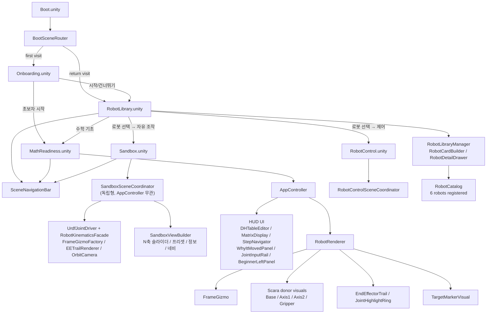
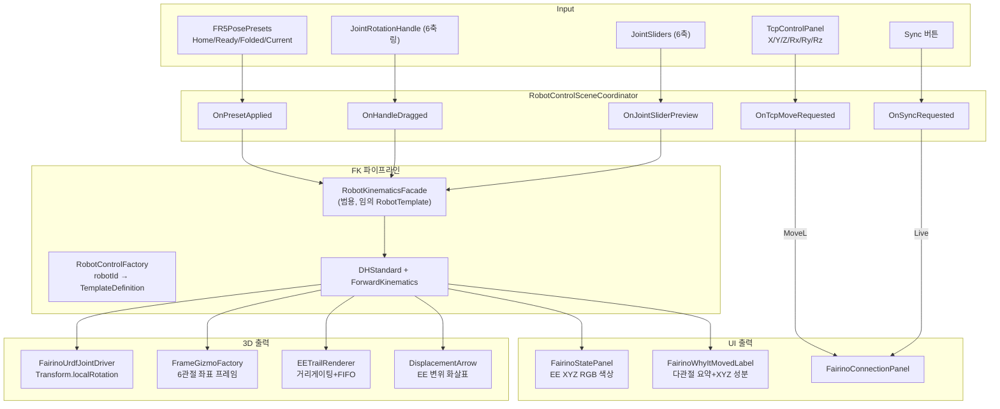
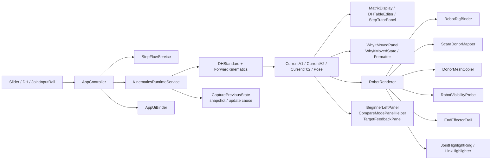
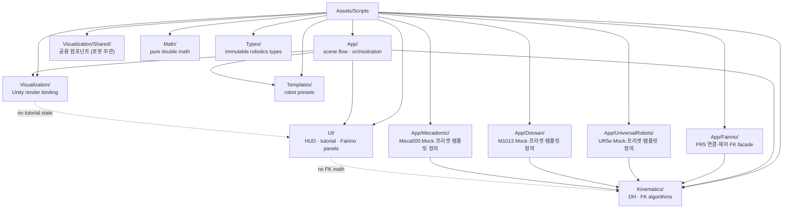
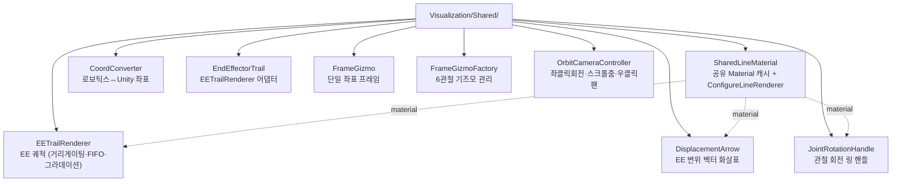
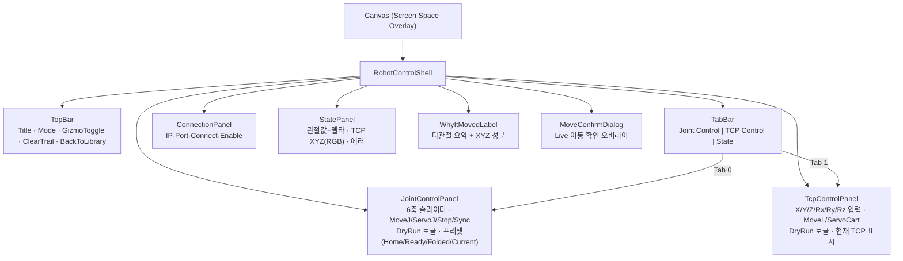

# KineTutor3D Architecture Mermaid

This is the fastest whole-system context document for new sessions.
Read this after `AGENTS.md` and before drilling into individual runtime files.

## 1. System Overview

## 2. RobotControl Scene Data Flow

## 3. Runtime Data Flow (Main/Sandbox)

## 4. Folder Responsibility Map

## 5. Visualization/Shared/ Component Tree

## 6. RobotControl UI Layout Tree

## 7. Scene Build Settings (index → scene)

| Index | Scene | 역할 |
|-------|-------|------|
| 0 | Boot | 라우터 전용 (첫 방문 판단) |
| 1 | Onboarding | 환영 모달, 초보자/기본 분기 |
| 2 | RobotLibrary | **메인 진입점** — 로봇 카탈로그 + 3D showroom |
| 3 | Sandbox | 자유 조작 |
| 4 | RobotControl | 로봇별 실기 제어 콘솔 |
| 5 | MathReadiness | 수학 기초 워밍업 |

## 8. Stable Invariants
- `frame_0`, `frame_1`, and `Frame_EE` are the canonical frame ownership points.
- `ScaraRobot.prefab` is the donor source; visual donor path uses `Base`, `Axis1`, `Axis2`, and `Axis3/Gripper`.
- `Pick` is a helper point, not a visual donor.
- `AppController` is the public runtime state and event facade (MathReadiness only, Sandbox separated).
- `SandboxSceneCoordinator` is the Sandbox scene facade (독립형, AppController 의존 없음, UrdfJointDriver + RobotKinematicsFacade + SandboxViewBuilder).
- `RobotControlSceneCoordinator` is the RobotControl scene facade (robotId→`RobotControlFactory`→`RobotControlTemplateDefinition` 동적 로드).
- `RobotKinematicsFacade` is the generic FK facade accepting any `RobotTemplate`.
- `RobotControlFactory` maps robotId string to `RobotControlTemplateDefinition`.
- `RobotRenderer` is the public visualization facade (2DOF/SCARA).
- `UrdfJointDriver` (Shared/) is the generic URDF joint driver (ArticulationBody auto-discovery, N-axis).
- `FairinoUrdfJointDriver` is the FR5-specific visualization driver (Transform-based, RobotControl only).
- `Math`, `Types`, and `Kinematics` stay pure C# `double`-based domain code.
- Build Settings: `Boot`(0), `Onboarding`(1), `RobotLibrary`(2), `Sandbox`(3), `RobotControl`(4), `MathReadiness`(5).
- `KinematicsRuntimeState` holds previous/current snapshots and `RuntimeUpdateCause`.
- `RobotCatalog` (Templates) is the single registry for all robot metadata + template factories (FR5, UR5e, Doosan M1013, Meca500, 2DOF_RR, SCARA_RV, Fanuc, igus 등록).
- `RobotSelectionBridge` (App) passes robot selection between scenes via PlayerPrefs.
- Scene cameras are managed by `SceneCameraDirector` (except RobotLibrary showroom).
- `IVisibilityControllable.SetVisible(bool)` is the standard panel visibility contract.
- `SharedLineMaterial` is the single LineRenderer material cache for all Visualization/Shared/ components.
- `IFairinoRobotClient` abstracts Mock/Live robot communication; `MoveJ`/`MoveL`/`ServoJ`/`StopMotion`.
