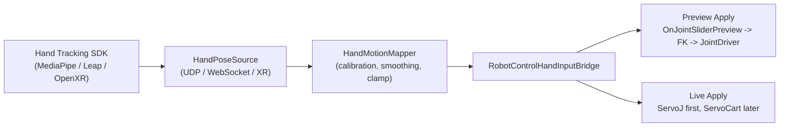
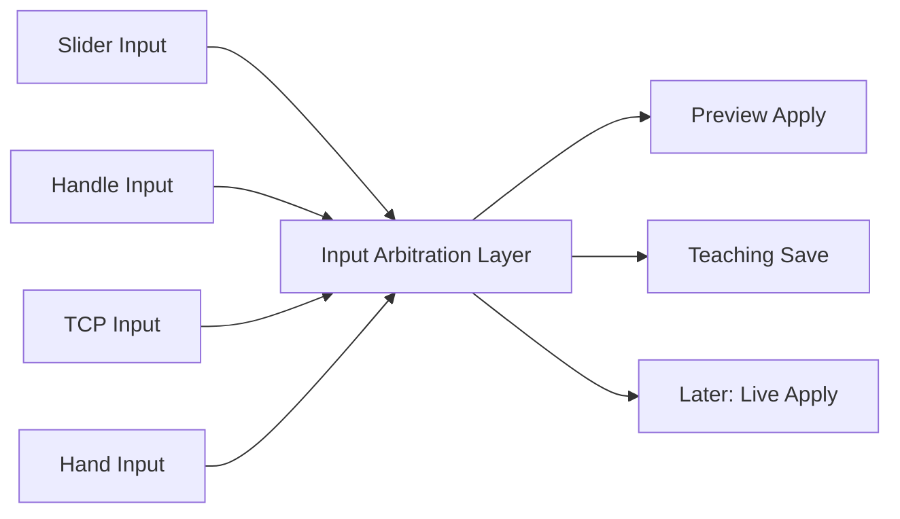
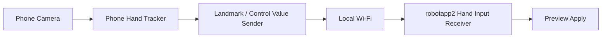
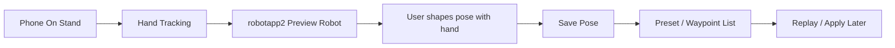

# Hand Motion Control Integration Reference

## Purpose

- 손 움직임 기반 로봇 제어를 `robotapp2`의 현재 `RobotControl` 구조에 어떻게 붙여야 하는지 정리한다.
- "지금 바로 구현 가능한 경로"와 "아직 없는 계층"을 분리해서 남긴다.
- FR5 파일럿 기준으로 정리하되, 이후 다른 로봇으로 일반화할 때의 경계도 함께 적는다.

## Parent Doc

- [fairino-fr5-integration-reference.md](./fairino-fr5-integration-reference.md)
- [robot-model-library-spec.md](./robot-model-library-spec.md)

## When To Read

- 손 추적 카메라, Leap Motion, OpenXR hand tracking, MediaPipe hand landmark 입력을 로봇 제어에 연결하려고 할 때
- `RobotControl`에 새 입력 소스를 붙이되 기존 slider, handle, FK, live adapter 구조를 최대한 재사용하고 싶을 때
- `joint teleop`부터 시작할지, `TCP hand follow`까지 바로 갈지 결정해야 할 때

## Current Conclusion

- 현재 저장소 기준 가장 안전한 1차 구현은 `joint-space hand teleop`이다.
- 이유:
  - `RobotControl`은 이미 `입력 -> FK -> 3D -> 상태 UI` 경로가 있다.
  - `ServoJ`까지는 live adapter 구조가 있다.
- 반면 일반적인 `손 위치 -> IK -> TCP 목표 -> ServoCart` 계층은 아직 없다.
- 따라서 첫 구현은 "손 포즈를 관절값 또는 관절 델타로 바꾸어 preview/live에 넣는 방식"이 적합하다.

## Product Destination

- 최종 목적지는 `Hand Teaching Mode`다.
- 이 모드의 정의:
  - `거치된 폰 카메라로 손동작을 읽고, robotapp2에서 로봇 포즈를 가르치고 저장하는 teaching 인터페이스`
- 핵심은 "계속 손으로 실시간 조종"이 아니라 "손으로 자세를 만들고 저장"하는 데 있다.

### Goal Statement

`Hand Teaching Mode는 거치된 폰 카메라가 사용자의 손동작을 추적하고, 사용자가 robotapp2 안에서 로봇 포즈를 직관적으로 만들고 저장하며, 이후 preset, waypoint, replay 흐름으로 이어지게 하는 teaching 인터페이스다.`

### Non-Goals

- 사용자가 폰을 손에 들고 계속 제어하는 방식
- 폰을 로봇에 매달아 카메라와 로봇이 같이 움직이는 방식
- 첫 구현부터 live robot을 실시간으로 계속 직접 구동하는 방식
- 첫 구현부터 TCP hand-follow와 일반 IK를 완성하는 방식

### Physical Setup Decision

- 폰은 `고정 거치대`에 둔다.
- 폰은 손에 들지 않는다.
- 폰은 로봇에 부착하지 않는다.

이유:

- 손 추적 기준 좌표가 안정적이다.
- 사용자의 양손이 자유롭다.
- 카메라 흔들림이 줄어든다.
- robotapp2의 teaching UI와 함께 쓰기 쉽다.

## Recommended Data Flow



## Extensibility Direction

- 최종 구조는 "손 입력을 기존 기능 위에 덧붙이는 방식"이 아니라 "입력 소스를 늘리고 중앙에서 중재하는 방식"을 목표로 한다.
- 즉 slider, handle, TCP, hand input은 서로를 덮어쓰는 것이 아니라 같은 `RobotControl` 안의 병렬 입력 소스가 되어야 한다.

### Architecture Principle



### Why This Matters

- 기존 `RobotControl` 기능을 깨지 않고 hand input을 추가할 수 있다.
- 나중에 손 입력을 꺼도 slider, handle, TCP 흐름은 그대로 유지된다.
- `Hand Teaching Mode`, `Manual Mode`, `Playback Mode`, `Live Mode` 같은 모드 전환이 쉬워진다.
- 향후 UDP 외에도 WebSocket, XR, Leap Motion, OpenXR 입력으로 교체하기 쉽다.

### Recommended Future Components

- `HandPoseSource`
- `HandMotionMapper`
- `RobotControlInputArbiter`
- `RobotControlHandTeachingService`
- `RobotControlLiveGate`

### Step 1 Definition

- 1단계의 성공 기준은 "로봇이 움직이는 것"이 아니라 "외부 hand input이 앱 안으로 실제로 들어온 것을 안정적으로 확인하는 것"이다.
- 현재 기준 최소 성공 신호는 아래다.
  - `RobotControl` 진단 서랍에서 `Hand Input: Fresh` 상태 확인
  - 최근 수신 `seq`, `tracked`, `handX`, `handY`, `pinch` 값 확인
  - timeout 이후 `Stale` 상태로 바뀌는지 확인

## Connectivity Recommendation

- 1차 파일럿은 `무선`을 기본으로 본다.
- 가장 현실적인 구조는 `폰에서 손 추적 -> landmark 또는 축약된 control 값만 로컬 Wi-Fi로 전송 -> PC의 robotapp2가 수신`이다.
- 이유:
  - 손 테스트 중 케이블 제약이 적다.
  - 영상 전체를 보내지 않고 숫자 값만 보내면 지연과 대역폭 부담이 작다.
  - 입력 소스를 나중에 바꿔도 수신 포맷만 유지하면 bridge 계층을 재사용할 수 있다.

### First Recommended Network Path



### Why Wireless First

- 첫 목적은 "연동이 되는지" 확인하는 것이다.
- 이 단계에서는 영상 스트리밍보다 손 landmark 또는 `handX`, `handY`, `pinch` 같은 축약 값 전달이 더 중요하다.
- 무선 LAN 안에서 값만 보내는 방식이 구현과 디버깅 모두 가장 단순하다.

### When To Consider Wired Later

- Wi-Fi가 불안정한 환경
- 지연 편차가 큰 환경
- 현장 네트워크 정책상 로컬 UDP/WebSocket 테스트가 어려운 환경

유선은 추후 안정화 단계에서 검토하고, 초기 파일럿은 무선으로 시작하는 편이 좋다.

## Hand Teaching Mode User Flow



### Core Interaction

1. 사용자가 폰을 거치대에 고정한다.
2. 폰이 손동작을 추적하고 `robotapp2`로 값을 보낸다.
3. `robotapp2`는 preview 로봇만 먼저 움직인다.
4. 사용자가 원하는 자세를 만든다.
5. 사용자가 `Save Pose`를 눌러 현재 자세를 저장한다.
6. 저장한 자세를 preset 또는 waypoint로 관리한다.
7. 이후에만 mock/live 적용을 검토한다.

## MVP Scope

- hand input receive
- hand -> joint mapping
- preview robot update
- current pose snapshot
- save pose
- pose list UI
- rename / overwrite / delete
- apply saved pose

## Later Scope

- live `ServoJ` teaching assist
- saved pose -> waypoint sequence
- replay controls
- operator confirmation flow
- richer gesture vocabulary
- TCP hand-follow or IK-backed Cartesian teaching

## Current Repo Hook Points

### Preview / FK / 3D

- `Assets/Scripts/App/Fairino/RobotControlSceneCoordinator.cs`
  - `OnJointSliderPreview(...)`가 현재 preview 입력의 핵심 진입점이다.
  - `OnHandleDragged(...)`도 결국 같은 preview 흐름으로 모인다.
- `Assets/Scripts/App/Runtime/RobotKinematicsFacade.cs`
  - 관절값을 degree로 받아 FK를 갱신한다.
- `Assets/Scripts/Visualization/RobotControl/FairinoUrdfJointDriver.cs`
  - 6축 URDF joint transform에 degree 값을 직접 반영한다.

### Live Robot

- `Assets/Scripts/App/Fairino/IFairinoRobotClient.cs`
  - `MoveJ`, `ServoJ`, `MoveL`, `ReadState` 인터페이스가 있다.
- `Assets/Scripts/App/Fairino/FairinoConnectionService.cs`
  - Mock/Live 전환, state polling, state updated 이벤트를 관리한다.
- `Assets/Scripts/App/Fairino/LiveFairinoClient.cs`
  - 실제 FAIRINO SDK reflection 호출을 감싼다.

## Recommended New Files

새 손 입력 계층은 `App` 폴더 책임에 맞게 별도 폴더로 빼는 것이 좋다.

- `Assets/Scripts/App/HandTracking/IHandPoseSource.cs`
- `Assets/Scripts/App/HandTracking/HandPoseSample.cs`
- `Assets/Scripts/App/HandTracking/UdpHandPoseSource.cs`
- `Assets/Scripts/App/HandTracking/WebSocketHandPoseSource.cs`
- `Assets/Scripts/App/HandTracking/HandMotionMapper.cs`
- `Assets/Scripts/App/HandTracking/RobotControlHandInputBridge.cs`

## Why A Separate Bridge

- 현재 `RobotControlSceneCoordinator`는 이미 큰 편이다.
- 손 추적은 입력 장치, 보정, smoothing, live safety policy까지 포함하므로 코디네이터에 바로 섞으면 책임이 커진다.
- App 폴더 규칙상 scene flow / orchestration은 App에 두되, 입력 상세 구현은 helper/service로 빼는 편이 맞다.

## Phase Recommendation

### P0. Joint-space preview only

- 손 입력을 받는다.
- 손 포즈를 joint delta 또는 absolute joint target으로 바꾼다.
- 결과를 `OnJointSliderPreview(...)`와 같은 흐름으로 preview에만 넣는다.
- 이 단계에서는 실기 명령을 보내지 않는다.

### P1. Joint-space live teleop

- preview에 쓰는 동일 joint target을 `ServoJ`로 live에 보낸다.
- 단, 아래 조건을 모두 충족할 때만 전송한다.
  - connected
  - enabled
  - joint limits 통과
  - 속도 제한 통과
  - deadzone 밖 입력
  - confirm or explicit live-arm state

### P2. TCP hand-follow

- 이 단계부터는 IK 또는 live-only Cartesian policy가 필요하다.
- 현재 repo에는 일반 IK solver가 없으므로, 바로 P2로 가면 구현 비용과 위험이 크게 올라간다.
- `ServoCart`를 도입하더라도 아래 둘 중 하나가 먼저 필요하다.
  - 안정적인 IK layer
  - "preview는 joint mode, live만 TCP mode"로 분리하는 별도 정책

## Mapping Recommendation

초기 손 제어는 아래처럼 단순한 매핑이 좋다.

- hand X -> base yaw delta
- hand Y -> shoulder / elbow blend
- pinch strength -> wrist or gripper intent
- palm rotation -> wrist orientation subset

초기 버전에서 피해야 할 것:

- 한 손 위치를 바로 6축 TCP pose에 1:1 대응
- depth noise를 그대로 live command에 전달
- calibration 없이 사용자마다 다른 기준 좌표 사용

## Wireless Safety Locks

무선 입력은 "연결되기만 하면 바로 제어"가 아니라, 처음부터 잠금 정책을 같이 가져가야 한다.

### Required Locks For The First Pilot

- `preview-only by default`
  - 기본값은 preview만 갱신하고 live robot command는 보내지 않는다.
- `allowlisted sender`
  - 지정한 폰 1대 또는 허용 IP만 입력을 받는다.
- `fixed port`
  - 예: `UDP 5005`처럼 고정 포트를 사용한다.
- `input clamp`
  - 수신 값은 허용 범위를 벗어나면 버리거나 clamp 한다.
- `deadzone`
  - 작은 흔들림은 0으로 처리한다.
- `max delta per update`
  - 한 프레임 또는 한 업데이트당 joint 변화량 상한을 둔다.
- `timeout stop`
  - 지정 시간 이상 패킷이 끊기면 즉시 neutral 또는 hold 상태로 복귀한다.
- `explicit arm gate`
  - 손이 보인다고 바로 제어하지 않고, 별도 arm 상태 또는 제스처로 제어 시작을 허용한다.
- `live send disabled until proven`
  - preview 검증이 끝나기 전에는 `ServoJ` 전송을 잠근다.

### Suggested First Defaults

```text
mode = preview_only
transport = udp
allowlist_phone_ip = single device
fixed_port = 5005
update_rate = 10 Hz
deadzone = 0.05
max_joint_delta = 2 deg per update
timeout = 0.5 sec
explicit_arm_required = true
live_robot_send = false
```

### Network Scope Rule

- 외부 인터넷 경로를 열지 않는다.
- 같은 로컬 Wi-Fi 또는 제한된 LAN 안에서만 테스트한다.
- 가능하면 게스트망 또는 실험용 SSID를 사용한다.
- 포트 포워딩, 공인 노출, 외부 터널링은 초기 파일럿에서 금지한다.

## Safety Guardrails

- deadzone
- low-pass smoothing
- max delta per frame clamp
- joint limit clamp
- workspace clamp
- live mode confirm gate
- emergency stop always visible
- mock/live color and label separation

## Known Blockers

- `RobotControlSceneCoordinator`의 TCP 요청 경로는 현재 실질적으로 로그/placeholder 단계다.
- 일반 IK solver가 없다.
- `IFairinoRobotClient`에는 `ServoCart`가 아직 없다.
- 현재 구조는 FR5 파일럿 기준으로 가장 자연스럽고, 바로 다로봇 공통화하기에는 `FairinoUrdfJointDriver` 의존이 남아 있다.

## Practical First Slice

1. 손 입력 수신기 추가
2. 손 포즈 -> joint target 매퍼 추가
3. 무선 LAN에서 landmark 또는 control value 수신 확인
4. preview에만 연결
5. `Save Pose` snapshot 흐름 추가
6. 저장 pose list UI 추가
7. mock mode에서 teaching loop 확인
8. `ServoJ` live 실험 추가
9. 이후에만 `TCP hand follow` 검토

## Do Not

- 첫 구현부터 `TCP hand follow`를 목표로 잡지 않는다.
- preview와 live safety policy를 같은 레벨에서 섞지 않는다.
- noisy landmark 값을 smoothing 없이 바로 `ServoJ`에 보내지 않는다.
- `showroom preview` prefab을 control hierarchy 대체 수단으로 쓰지 않는다.
- 사용자가 폰을 계속 손에 들고 있어야 하는 UX를 목표로 잡지 않는다.
- 폰을 로봇에 부착한 상태를 기본 구조로 가정하지 않는다.

## Part-Separation Reading List

파츠 분리 또는 mesh 누락 이슈를 다시 볼 때는 아래 순서가 가장 빠르다.

1. `docs/status/page-qa/robot-control.md`
2. `docs/daily/03-16/robotcontrol-fr5-control-prefab-repair.md`
3. `docs/daily/03-13/robotcontrol-fr5-and-camera-centralization.md`
4. `docs/daily/03-17/fairino-official-docs-to-unity-flow.md`
5. `Assets/Editor/KineTutor3D/QaToolsMenu.cs`
6. `Assets/Scripts/Visualization/RobotLibrary/RobotPreviewFactory.cs`
7. `Assets/Scripts/Visualization/Renderer/DonorMeshCopier.cs`

## Copy-Paste Paths

```text
C:\Users\ezen601\Desktop\Jason\robotapp2\docs\status\page-qa\robot-control.md
C:\Users\ezen601\Desktop\Jason\robotapp2\docs\daily\03-16\robotcontrol-fr5-control-prefab-repair.md
C:\Users\ezen601\Desktop\Jason\robotapp2\docs\daily\03-13\robotcontrol-fr5-and-camera-centralization.md
C:\Users\ezen601\Desktop\Jason\robotapp2\docs\daily\03-17\fairino-official-docs-to-unity-flow.md
C:\Users\ezen601\Desktop\Jason\robotapp2\Assets\Editor\KineTutor3D\QaToolsMenu.cs
C:\Users\ezen601\Desktop\Jason\robotapp2\Assets\Scripts\Visualization\RobotPreviewFactory.cs
C:\Users\ezen601\Desktop\Jason\robotapp2\Assets\Scripts\Visualization\DonorMeshCopier.cs
C:\Users\ezen601\.codex\skills\unity-urdf-donor-preview-debug\SKILL.md
C:\Users\ezen601\.codex\skills\robotapp2-robot-showroom-debug\SKILL.md
```
