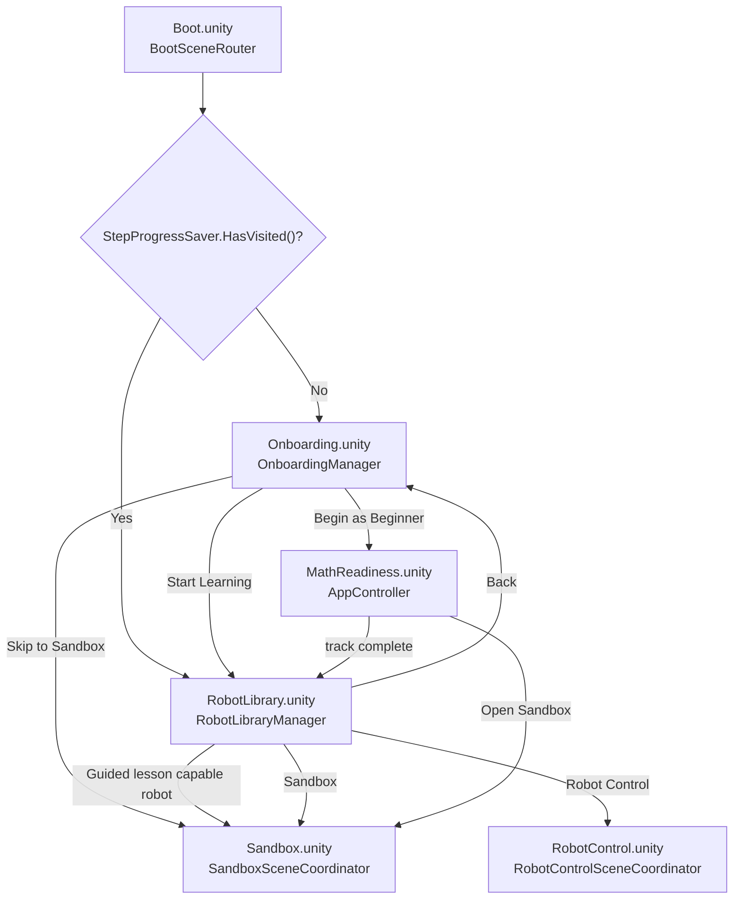
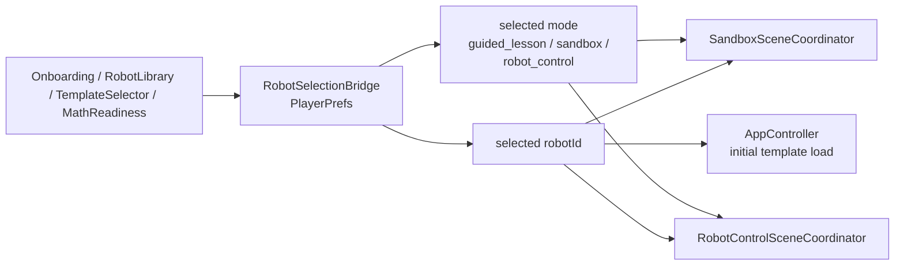
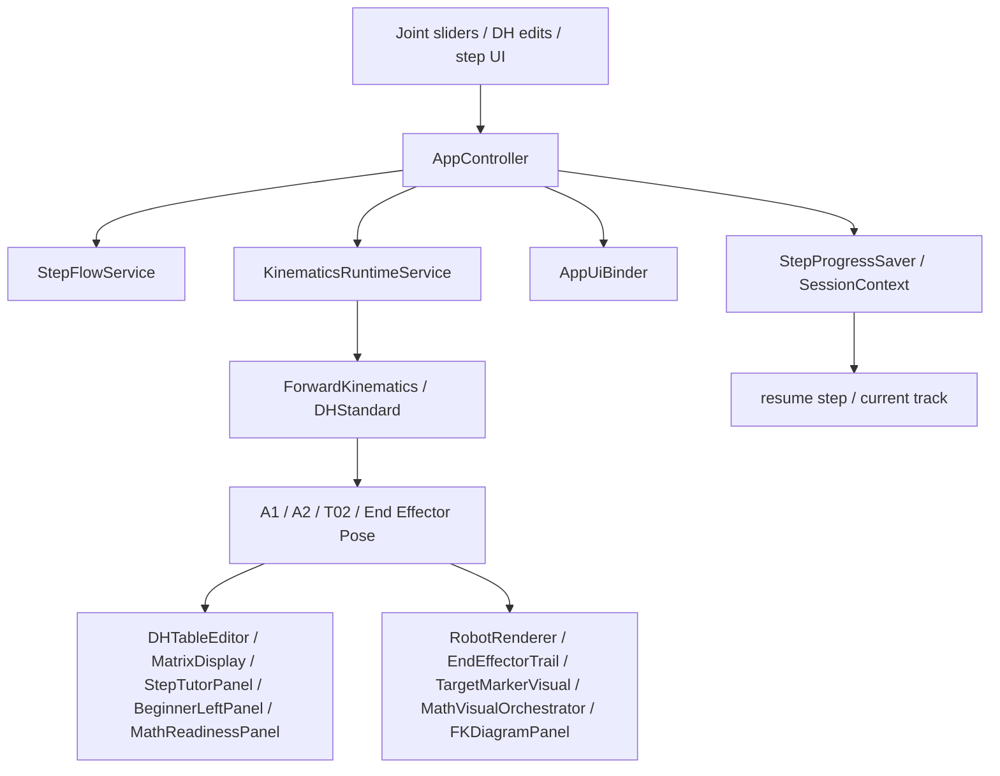
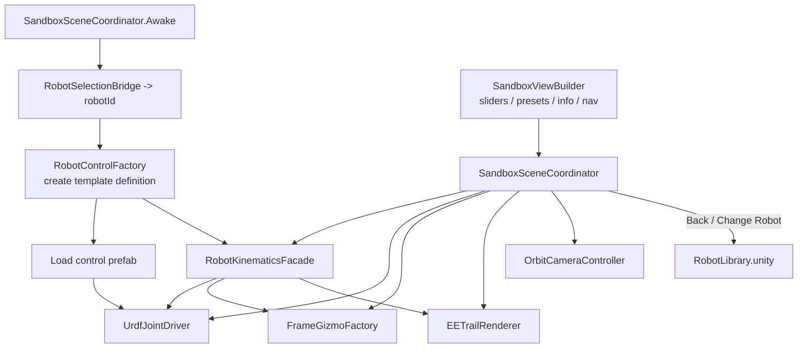
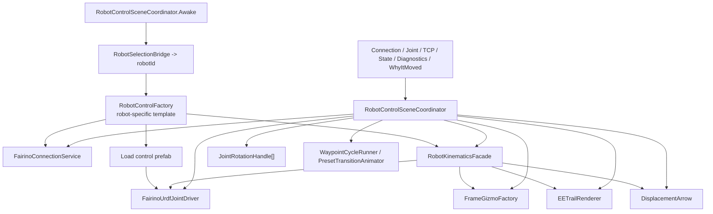

# KineTutor3D Project Flow (Code-Reviewed)

Last Reviewed: 2026-03-31 (KST)

This document is a code-derived flow snapshot for quick project orientation.
It was reviewed against the current runtime entry points instead of older planning-only diagrams.

Primary source files:
- `Assets/Scripts/App/BootSceneRouter.cs`
- `Assets/Scripts/App/SceneCatalog.cs`
- `Assets/Scripts/App/SceneNavigator.cs`
- `Assets/Scripts/App/RobotSelectionBridge.cs`
- `Assets/Scripts/App/AppController.cs`
- `Assets/Scripts/App/SandboxSceneCoordinator.cs`
- `Assets/Scripts/App/Fairino/RobotControlSceneCoordinator.cs`
- `Assets/Scripts/UI/Onboarding/OnboardingManager.cs`
- `Assets/Scripts/UI/RobotLibrary/RobotLibraryManager.cs`

## 1. Scene Entry Flow

## 2. Selection And Mode Bridge

## 3. Guided Lesson Runtime Flow

## 4. Sandbox Runtime Flow

## 5. RobotControl Runtime Flow

## 6. Notes

- The best existing whole-system diagram is still `docs/ref/architecture-mermaid.md`.
- `docs/ref/architecture-diagrams.md` contains older naming such as `Main.unity`, so treat it as historical unless it is refreshed.
- The actual navigable scenes in code are `MathReadiness`, `RobotLibrary`, `Sandbox`, and `RobotControl`; `Boot` and `Onboarding` are not shown in the regular navigation list.
